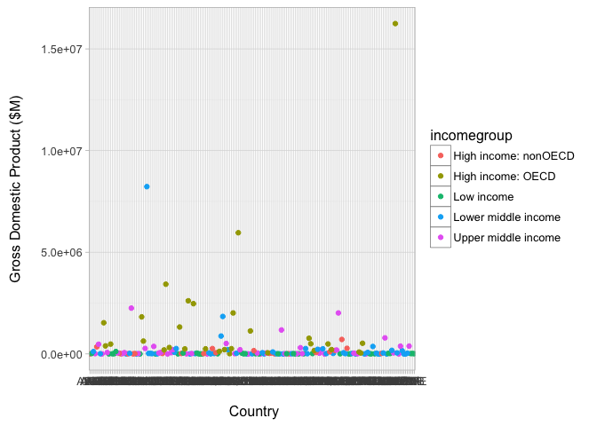

# GDP Analysis
Peter Byrd  
October 30, 2016  

# Analysis of GDP rankings by country

The analysis below pulls data from multiple data sources related to gross domestic product and income categories by country.  The data is merged and cleaned before proceeding to analysis.  In the analysis, will sort on GDP rank and determine average GDP rank by income categories.  We will also compare GDP rank and Income levels and plot the data in a scatter plot.  

## Load data
First we must load the appropriate data from our data sources.


```r
## Set the working directory and load packages
setwd("/Users/pbyrd/Git/CaseStudy1")
library(plyr)
library(dplyr)
```

```
## 
## Attaching package: 'dplyr'
```

```
## The following objects are masked from 'package:plyr':
## 
##     arrange, count, desc, failwith, id, mutate, rename, summarise,
##     summarize
```

```
## The following objects are masked from 'package:stats':
## 
##     filter, lag
```

```
## The following objects are masked from 'package:base':
## 
##     intersect, setdiff, setequal, union
```

```r
library(ggplot2)

## Read CSV input file
gdp <- read.csv("Data/getdata_data_GDP.csv", skip=4,header=TRUE)
edu <- read.csv("Data/getdata_data_EDSTATS_Country.csv", header=TRUE)
```

## Clean and Merge the data

Next we need to clean the data by first creating a subset of the data and removing unnecessary columns.  We also want to rename and modify our variable types before merging the data by the variable 'countrycode'.  Finally we want to remove missing values and keep a count of how many observations were removed.  This will create our final clean dataset.


```r
## Create a subset of the gdp data with only the columns we want
gdp_new <- gdp
gdp_new <- gdp_new[,-c(3,6,7,8,9,10)]    # remove columns with no data

## Create a subset of the edu data with only the columns we want
edu_new <- edu
edu_new <- edu_new[,c(1,3)]              # keep only the columns we need for our analysis

## Rename variables
gdp_new <- plyr::rename(x=gdp_new,
                        replace = c("X"="countrycode","X.1"="gdprank","X.3"="countryname",
                                    "X.4"="gdp"))
edu_new <- plyr::rename(x=edu_new,
                        replace = c("CountryCode"="countrycode","Income.Group"="incomegroup"))

## Modify variable types
gdp_new$gdp <- as.numeric(gsub("[^[:digit:]]","",gdp_new$gdp))
gdp_new$gdprank <- as.numeric(gsub("[^[:digit:]]","",gdp_new$gdprank))

## Merge the data by country shortcode
gdp_combined <- merge(gdp_new,edu_new, by="countrycode",all=TRUE)

## Remove missing values and unwanted data from merged data
temp1 <- dim(gdp_combined)
gdp_combined <- subset(x=gdp_combined,!is.na(gdp)) #remove observations without GDP data
gdp_combined <- subset(x=gdp_combined,!is.na(gdprank) & !is.na(incomegroup)) #remove observations not in ranking
temp2 <- dim(gdp_combined)
deletedvalues <- temp1[1]-temp2[1]
deletedvalues    # this is the number of observations with NA that were deleted
```

```
## [1] 147
```

We see from the 'deletedvalues' that we have deleted 147 observations from the cleaned data.

## Analyze the data

Now that we have a clean dataset, we want to run some analysis on the data.  

### Matching country codes

First we want to determine how many of the countrycode ID's matched between the datasets. 


```r
## How many of the IDs matched
match=dim(gdp_combined)
match[1]          # shows the number of IDs that matched
```

```
## [1] 189
```

We have 189 observations to work with from the merged and cleaned datasets.

### Sort by GDP rank

Now we want to order the data in ascending order by GDP and find the country listed 13th.


```r
## Sort the data in ascending order by gdp; what is the 13th country?
gdp_combined <- gdp_combined[order(gdp_combined$gdp),]
gdp_combined[13,]
```

```
##     countrycode gdprank         countryname gdp         incomegroup
## 205         KNA     178 St. Kitts and Nevis 767 Upper middle income
```

The 13th country listed in order of ascending GDP is St. Kitts and Nevis with a GDP of $767M.

### Average GDP rank for High Income: OECD and nonOECD

Next we want to determine the average GDP ranking for high income: OECD and nonOECD income classes.  


```r
## Average GDP rankings for High Income:OECD and High Income:nonOECD groups?
avgrank_oecd <- mean(gdp_combined$gdprank[gdp_combined$incomegroup=="High income: OECD"])
avgrank_noecd <-mean(gdp_combined$gdprank[gdp_combined$incomegroup=="High income: nonOECD"])
avgrank_oecd      # High Income: OECD countries
```

```
## [1] 32.96667
```

```r
avgrank_noecd     # High Income: non OECD countries
```

```
## [1] 91.91304
```

We see that the average GDP rank for High Income: OECD countries is 32.97;
and we see that the average GDP rank for High Income: nonOECD countries is 91.91.

### Plot of GDP by Country and color coded by Income level

Now we will plot the data by country and GDP amount and color code our results by income level.


```r
## Plot the data using ggplot
ggplot(gdp_combined,aes(gdp_combined$countrycode,gdp_combined$gdp))+geom_point(aes(col=incomegroup))+xlab("\n Country")+ylab("Gross Domestic Product ($M)\n")+theme_light()
```

<!-- -->

From the plot we see a strong relation between GDP and High Income levels, with the Low and Middle income levels stacking near the bottom.

### Table of GDP rank by Income group

Finally, we will segment the data into five groups by GDP rank, and create a table of GDP group crossed by Income group.  This will give us a better indication of how GDP and Income level are related.  


```r
# Cut the GDP ranking into five groups and make a table of income group vs gdprank
gdp_combined$gdpgroup<-cut(gdp_combined$gdprank,breaks=c(-0.5,38.5,76.5,114.5,152.5,190.5),labels=c("High GDP","Med-High GDP","Medium GDP","Med-Low GDP","Low GDP"))
table(gdp_combined$gdpgroup,gdp_combined$incomegroup)
```

```
##               
##                   High income: nonOECD High income: OECD Low income
##   High GDP      0                    4                18          0
##   Med-High GDP  0                    5                10          1
##   Medium GDP    0                    8                 1          9
##   Med-Low GDP   0                    4                 1         16
##   Low GDP       0                    2                 0         11
##               
##                Lower middle income Upper middle income
##   High GDP                       5                  11
##   Med-High GDP                  13                   9
##   Medium GDP                    12                   8
##   Med-Low GDP                    8                   8
##   Low GDP                       16                   9
```

From the table we can see that are 5 countries that are Lower Middle Income but also among the 38 nations with the highest GDP.

## Conclusion

From the analysis, it appears that GDP level is related to Income level within the country.  Although we see some outliers, there appears to be a positve relationship with GDP and Income level.  Further regression analysis could be performed on GDP and Income level to better quantify the relationship.  
